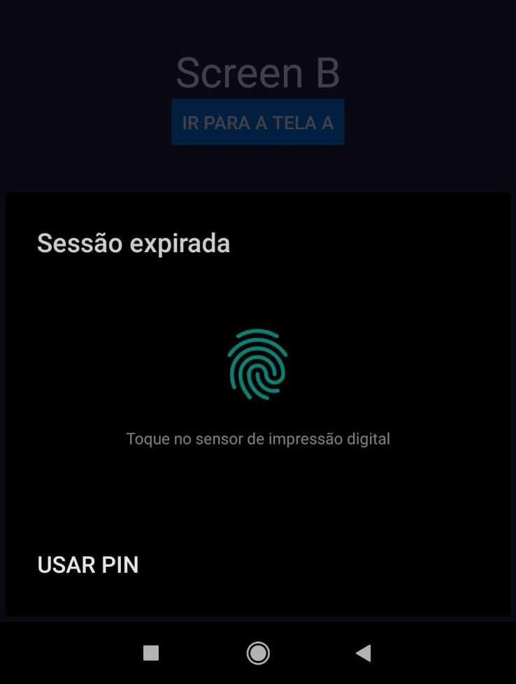

# Autenticação Biometrica


<div>
  
   
   
  </div>



<h1>Autenticação com biometria - Mobile</h1>
<h3>Implementação da função LocalAuthentication, um módulo do Expo que permite realizar autenticação biométrica (como impressão digital ou reconhecimento facial) em aplicativos React Native de forma simples e segura. Em conjunto, também foi utilizado o Reac Navigation para fazer a navegação em stack e o Toastify para retorar uma mensagem de sucesso.</h3>
  
<h2>Alguns exemplos de uso:</h2>
  
* Autenticar o usuário antes de permitir acesso a áreas sensíveis do aplicativo.
* Substituir o login convencional por autenticação biométrica para maior comodidade.
* Implementar uma camada adicional de segurança ao efetuar pagamentos ou transações sensíveis no aplicativo.


## 💻 Pré-requisitos

Antes de começar, verifique se você atendeu aos seguintes requisitos:

* Você instalou a versão mais recente do `Node.JS`
* Você tem uma máquina `Windows/Mac e Android/IOS`.
* Você tem a autenticação por biometria ativada em seu smartphone ou emulador.


## 🚀 Instalando

Para instalar o autenticador biometrico, siga estas etapas:

Windows e macOS:
```
# Clone esse repositório:
$ git clone https://github.com/lsouza32/Autenticacao-biometrica.git

# Entre no diretório:
$ cd Autenticacao-biometrica

# Instale as dependencias:
$ npm install

# Inicie o projeto:
$ npx expo start

# Abra o aplicativo no Android ou IOS usando seu emulador ou seu app Expo.

```

## ☕ Usando o Autenticador

Para usar o Autenticador, siga estas etapas:

```
# A tela inicial do aplicativo é a Screen A.
# A Screen B é a tela que simula uma área sensível, então é a tela que exige a autenticação.
# Ao clicar no botão "IR PARA A TELA B" o aplicativo inicia uma contagem de 10 segundos.
# Após expirar o tempo de 10 segundos a aplicação irá solicitar a autenticação.
# Depois efetuar a atutenticação com sucesso, você terá mais 10 segundos antes de ser solicitado a autenticação novamente.

```

## O projeto Autenticador tem um designer simples, seu dever é apenas mostrar a forma de usar o módulo expo-local-authentication.

<video src="./src/assets/video-exemplo.mp4" controls title="Title"></video>